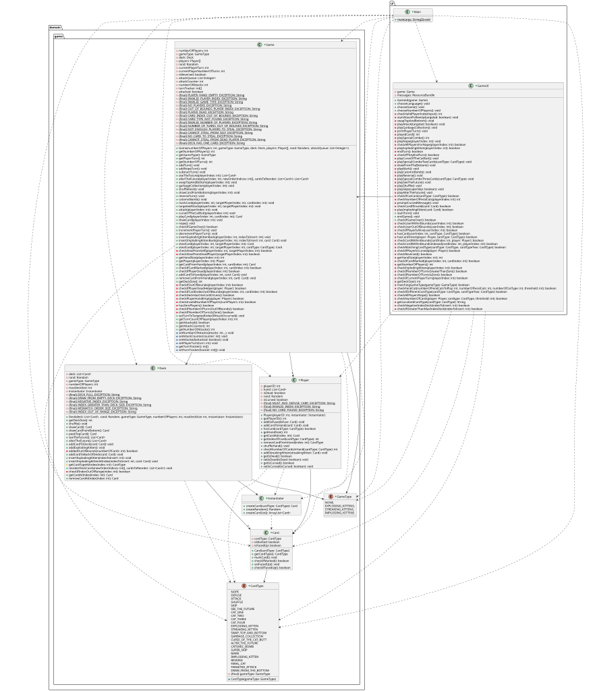
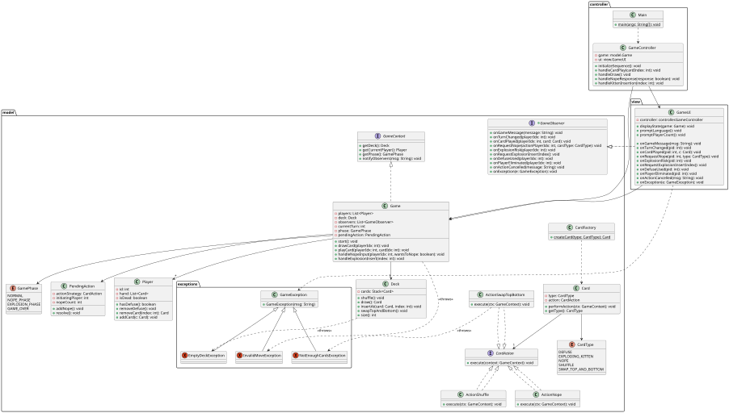

# Software Design Analysis

## Initial Design Diagram

## Design Diagram

## Analysis of the Changes

### 1. Architectural change: One god class (Game) to MVC pattern
* **Change:**
    * **Before:** The `Game` class was a "God Object." It managed game rules, player turns, deck logic, and contained exception strings.
    * **After:** The system is split into **Model** (`Game`, `Deck`, `Player`), **View** (`GameUI`), and **Controller** (`GameController`).
* **Analysis:** The original design suffered from **Low Cohesion**. The `Game` class knew too much and did too much. By separating responsibilities to smaller classes, the code is now easier to test and maintain. The `GameController` now handles the flow, `Game` only manages state, and `GameUI` only handles I/O.
* **Principles Applied:**
    * **10. Single Responsibility Principle:** Each class now has one reason to change (UI changes affect only `GameUI`, Rules affect only `Game`).
    * **15. High Cohesion:** Related functions are grouped into specific layers.

### 2. Applied Strategy Pattern for Card Actions
* **Change:**
    * **Before:** The `Game` class had specific methods for every card type.
    * **After:** The `Game` class delegates the method “execute” to a `CardAction` interface. Concrete strategies like `ActionPassive`, `ActionShuffle`, `ActionNope`, and `ActionSwapTopBottom` implement the specific logic.
* **Analysis:** The old design violated the **Open/Closed Principle**. Adding a new card type required modifying the `Game` class. The new design allows adding new cards by simply creating a new class that implements `CardAction`, without touching existing code.
* **Principles Applied:**
    * **3. Information Hiding:** The Game doesn't know *how* the action works.
    * **4. Encapsulate what varies:** Card behaviors vary, so they are encapsulated in their own classes.
    * **6. Program to interface, not implementation:** The `Card` class depends on the `CardAction` interface, not specific implementation details.
    * **5. Favor composition over inheritance:** `Card` is composed of a behavior (action), making it flexible.

### 3. Applied Observer Pattern
* **Change:**
    * **Before:** The `GameUI` was tightly coupled to specific methods in `Game`.
    * **After:** The `Game` class implements a notification system (`notifyObservers`), and `GameUI` implements the `GameObserver` interface to react to events.
* **Analysis:** This decouples the Model from the View. The `Game` class no longer needs to know *how* the game is displayed. It just broadcasts events.
* **Principles Applied:**
    * **7. Strive for loosely coupled designs:** The Model knows it has observers, but doesn't know *who* they are.
    * **14. Dependency Inversion Principle:** The high-level module (Game) does not depend on the low-level module (GameUI). Both depend on an abstraction (GameObserver).

### 4. Applied Custom Exceptions for Error Handling
* **Change:**
    * **Before:** Errors were handled via a long list of `String` constants in the `Game` class (e.g., `PLAYER_HAND_EMPTY_EXCEPTION`).
    * **After:** Add an `exceptions` package with specific classes (`EmptyDeckException`, `InvalidMoveException`) inheriting from a base `GameException`.
* **Analysis:** Using Strings for errors is prone to typos. Custom exceptions provide type safety and allow the Controller to handle specific error scenarios more gracefully.
* **Principles Applied:**
    * **1. Encapsulation:** Error details are encapsulated within exception objects rather than exposed as public constants.

### 5. Introduction of Explicit State Management (GamePhase)
* **Change:**
    * **Before:** Game state was likely implicit or managed by flags and variables scattered mainly in GameUI and Game.
    * **After:** An explicit `GamePhase` enum (`NORMAL`, `NOPE_PHASE`, `EXPLOSION_PHASE`) dictates what actions are legal.
* **Analysis:** This acts as a State Machine. It prevents illegal moves (like playing a Shuffle card while resolving an Explosion) by explicitly checking the phase. It makes the control flow predictable.
* **Principles Applied:**
    * **15. High Cohesion:** Instead of state logic being scattered across multiple variables, it is unified into a single concept (GamePhase).
    * **1. Encapsulation:** The "State" of the application is encapsulated into a specific field, protecting the game flow from being put into an invalid state manually.

### 6. Introduction of PendingAction for Complex Interactions
* **Change:**
    * **Before:** The logic for "Noping" was implemented using recursion mixed directly with Blocking UI (Scanner).
    * **After:** A `PendingAction` class stores the target action and an integer `nopeCount`. The resolution logic is determined by checking the state (Odd vs Even) stored in this object.
* **Analysis:** The original recursive approach was brittle and hard to unit test because it halted code execution to wait for console input inside the logic loop. By reifying the concept of an interrupted action, we separated the **User Interface flow** (looping through players) from the **Game Logic** (calculating if the action is cancelled).
* **Principles Applied:**
    * **1. Encapsulation:** We encapsulated the state of the "interrupt" (the `nopeCount` and the original action) into a dedicated object (PendingAction), rather than relying on the transient state of recursive method calls.
    * **7. Strive for loosely coupled designs:** The Model no longer relies on blocking UI calls to determine the outcome of a card.

### 7. Refactoring the Deck Class
* **Change:**
    * **Before:** `Deck` contained references to `GameType`, `Instantiator`, and game-specific rules (removeBombs).
    * **After:** `Deck` is a simple data structure managing a `List<Card>` with standard operations (`draw`, `shuffle`, `insertAt`).
* **Analysis:** The original Deck had "Feature Envy"—it was trying to manage game rules instead of just managing cards. The refactored Deck is highly cohesive and reusable.
* **Principles Applied:**
    * **15. High Cohesion:** The class now focuses on one thing: managing the collection of cards.
    * **9. Principle of Least Knowledge:** The Deck no longer needs to know about `GameType` or `Instantiator`.